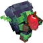
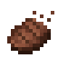

# Devformed Fabric 26.2

Воспроизводимый модпак для **Minecraft 26.2**, **Fabric Loader 0.19.3** и **Java 25**.

В составе 15 пользовательских модов: 13 исходно запрошенных и 2 поддерживаемые замены. Ещё 7 технических зависимостей подтягиваются автоматически. JAR-файлы не хранятся в Git: сборщик скачивает зафиксированные официальные релизы и проверяет их хеши.

## Быстрый запуск клиента

### Официальный Minecraft Launcher

1. Установи профиль **Fabric Loader 0.19.3** для **Minecraft 26.2** через [Fabric Installer 1.1.2](https://maven.fabricmc.net/net/fabricmc/fabric-installer/1.1.2/fabric-installer-1.1.2.jar).
2. Выбери для профиля **Java 25**.
3. Скачай клиентский набор:

```bash
python3 tools/modpack.py materialize client build/client/mods
```

4. Перенеси содержимое `build/client/mods` в папку `mods` игрового профиля.

### Prism Launcher

1. Скачай [`release/devformed-fabric-26.2.mrpack`](release/devformed-fabric-26.2.mrpack).
2. Выбери **Add Instance → Import** и укажи файл.
3. Назначь инстансу **Java 25**. Minecraft и Fabric Loader установятся из зафиксированного manifest.

## Моды — по убыванию важности

<a href="https://modrinth.com/mod/jei"></a>
**[Just Enough Items (JEI)](https://modrinth.com/mod/jei)** · `30.15.0.121` · `client` · `beta`<br>
Рецепты и применение предметов.
<br clear="left">

<a href="https://modrinth.com/mod/explorers-compass"></a>
**[Explorer's Compass](https://modrinth.com/mod/explorers-compass)** · `2.5.1` · `client + server`<br>
Поиск структур компасом.
<br clear="left">

<a href="https://modrinth.com/mod/mouse-tweaks"></a>
**[Mouse Tweaks](https://modrinth.com/mod/mouse-tweaks)** · `2.31` · `client`<br>
Быстрые жесты в инвентаре.
<br clear="left">

<a href="https://modrinth.com/mod/better-than-mending"></a>
**[Better Than Mending](https://modrinth.com/mod/better-than-mending)** · `2.3.0` · `client + server`<br>
Ручной ремонт предметов опытом.
<br clear="left">

<a href="https://github.com/MrCrayfish/GoblinTraders"></a>
**[Goblin Traders](https://github.com/MrCrayfish/GoblinTraders)** · `1.12.0` · `client + server`<br>
Гоблины с редкими сделками.
<br clear="left">

<a href="https://modrinth.com/mod/variants-and-ventures"></a>
**[Variants&Ventures](https://modrinth.com/mod/variants-and-ventures)** · `1.0.26` · `client + server`<br>
Новые варианты знакомых мобов.
<br clear="left">

<a href="https://modrinth.com/mod/connected-glass"></a>
**[Connected Glass](https://modrinth.com/mod/connected-glass)** · `1.1.14` · `client + server`<br>
Стекло без внутренних швов.
<br clear="left">

<a href="https://modrinth.com/mod/lambdynamiclights"></a>
**[LambDynamicLights](https://modrinth.com/mod/lambdynamiclights)** · `4.12.2` · `client`<br>
Динамический свет от предметов.
<br clear="left">

<a href="https://modrinth.com/mod/reconnectible-chains"></a>
**[Reconnectible Chains](https://modrinth.com/mod/reconnectible-chains)** · `1.2.6` · `client + server` · замена Connectible Chains<br>
Декоративные цепи между заборами.
<br clear="left">

<a href="https://modrinth.com/mod/freecam"></a>
**[Freecam](https://modrinth.com/mod/freecam)** · `1.4.1-beta.3` · `client` · `beta`<br>
Свободная камера без движения игрока.
<br clear="left">

<a href="https://github.com/MrCrayfish/Catalogue"></a>
**[Catalogue](https://github.com/MrCrayfish/Catalogue)** · `1.12.3` · `client`<br>
Экран списка и настроек модов.
<br clear="left">

<a href="https://modrinth.com/mod/dark-paintings"></a>
**[Dark Paintings](https://modrinth.com/mod/dark-paintings)** · `26.2.0.1` · `client + server`<br>
Множество новых картин.
<br clear="left">

<a href="https://modrinth.com/mod/fallingleaves"></a>
**[Falling Leaves](https://modrinth.com/mod/fallingleaves)** · `2.0.7` · `client`<br>
Падающие листья под деревьями.
<br clear="left">

<a href="https://modrinth.com/mod/eating-animation-fork"></a>
**[Eating Animation Fork](https://modrinth.com/mod/eating-animation-fork)** · `2.1.0` · `client` · замена Eating Animation<br>
Еда видна во время еды.
<br clear="left">

<a href="https://modrinth.com/mod/im-fast"></a>
**[I'm Fast](https://modrinth.com/mod/im-fast)** · `1.0.3` · `server`<br>
Убирает серверное ограничение скорости движения.
<br clear="left">

<details>
<summary><strong>7 технических зависимостей</strong></summary>

- Fabric API
- Cloth Config
- Fusion
- SuperMartijn642's Core Lib
- YetAnotherConfigLib (YACL)
- Resourceful Lib
- Framework

</details>

## Сервер и проверка сборки

```bash
# Сервер: 14 JAR, включая server-only I'm Fast
python3 tools/modpack.py materialize server build/server/mods

# Пересобрать и полностью проверить pack
python3 tools/modpack.py build
python3 tools/modpack.py verify
```

`build/` намеренно не попадает в Git. Полный источник истины — [`pack/mods.lock.json`](pack/mods.lock.json); стандартный Modrinth manifest — [`pack/modrinth.index.json`](pack/modrinth.index.json).

## Что не вошло

Для Enderman Overhaul, From The Fog, Blossom Blade, Naturalist и Ribbits нет официального Fabric-релиза, явно совместимого с Minecraft 26.2. AI Improvements для 26.2 выпущен только под NeoForge. Несовместимые JAR не подмешиваются; подробности находятся в [`pack/unsupported.json`](pack/unsupported.json).

Источники и лицензии перечислены в [`pack/NOTICE.md`](pack/NOTICE.md).
